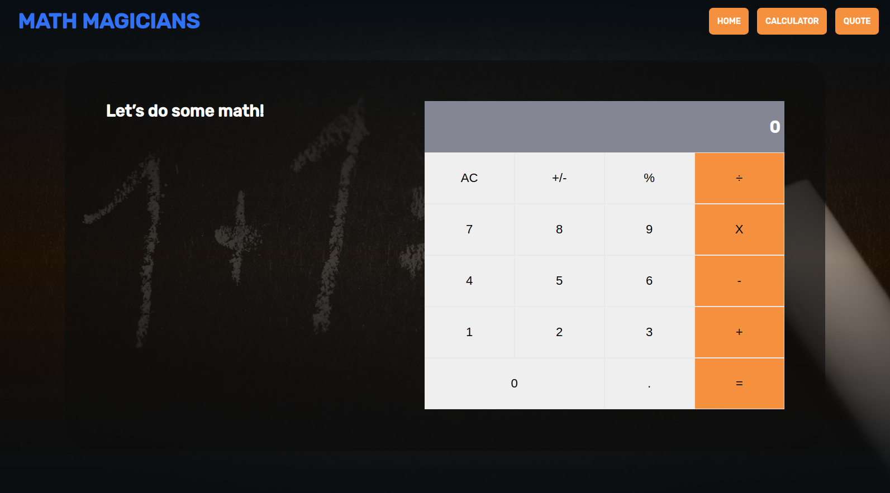

# Calculator React App using React.js

>   I base this project on the practice for React.js using class components. This app is a calculator to do some basic operations.

## Built With

- React.js
- CSS.
- big.js.
- prop-types
- react-dom.
- styled-components.

## Live Demo

[Live version](https://priceless-nobel-1a6837.netlify.app/)

## Prerequisites

node: v12.19.0
## Getting Started
To get a local copy up and running follow these simple example steps.

- Open a terminal or command prompt interface on your PC.
- Clone the repo with: `https://github.com/kenderb/calculator-react-app.git`
- On the terminal navigate to the project directory using `cd calculator-react-app/`

## 📝 Setup

1. On the terminal navigate to the project directory using `cd calculator-react-app/`.
2. Install dependencies using: `npm install`.
2. Run a server using: `npm start`.

## Authors

👤 **Kender Bolivar**

- GitHub: [@kenderb](https://github.com/ken)
- Twitter: [@KBTarts](https://twitter.com/KBTarts )
- LinkedIn: [KenderBolivar](https://www.linkedin.com/in/kender-bolivar-1736086b/ )

## 🤝 Contributing

Contributions, issues and feature requests are welcome!

Feel free to check the [issues page](https://github.com/kenderb/calculator-react-app/issues).

## Show your support

Give a ⭐️ if you like this project!

## :grey_exclamation: Acknowledgments

- Stack Overflow
- Odin Project.

## 📝 License

[MIT LICENSE](LICENSE)
